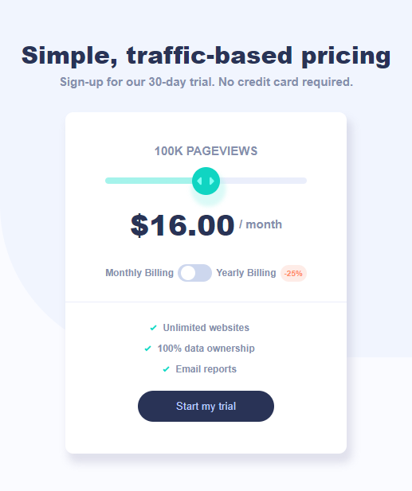

# Frontend Mentor - Interactive pricing component solution

This is a solution to the [Interactive pricing component challenge on Frontend Mentor](https://www.frontendmentor.io/challenges/interactive-pricing-component-t0m8PIyY8). Frontend Mentor challenges help you improve your coding skills by building realistic projects. 

## Table of contents

- [Overview](#overview)
  - [The challenge](#the-challenge)
  - [Screenshot](#screenshot)
  - [Links](#links)
- [My process](#my-process)
  - [Built with](#built-with)
  - [Useful resources](#useful-resources)
- [Author](#author)

## Overview

### The challenge

Users should be able to:

- View the optimal layout for the app depending on their device's screen size
- See hover states for all interactive elements on the page
- Use the slider and toggle to see prices for different page view numbers

### Screenshot

### Links

- Solution URL: [GitHub](https://github.com/Danielhu3/pricing-component)
- Live Site URL: [Netlify](https://jade-dolphin-6b66a1.netlify.app/)

## My process

### Built with

- Semantic HTML5 markup
- CSS custom properties
- Flexbox
- CSS Grid
- Mobile-first workflow
- [React](https://reactjs.org/) - JS library
- [Styled Components](https://styled-components.com/) - For styles

### Dependencies 

Styled-components:
 - Library to use CSS-in-JS
 - npm install styled-components

@types/styled-components:
 - Styled components definitions for typescript
 - npm install @types/styled-components -D

### Useful resources

- [Checkbox Toggle Slider](https://codepen.io/AllThingsSmitty/pen/MmxxOz/) - This helped me build the toggle checkbox css to alternate between monthly and yearly.

- [Range input Filling](https://codepen.io/geno-code/pen/BaLrKLM) - This helped me build the range input css.

- [Get window dimensions](https://stackoverflow.com/questions/36862334/get-viewport-window-height-in-reactjs) - This helped me get window's width to apply mobile modifiers.

## Author

- Frontend Mentor - [@Danielhu3](https://www.frontendmentor.io/profile/Danielhu3)
- Twitter - [@danielmaggot_](https://www.twitter.com/danielmaggot_)

